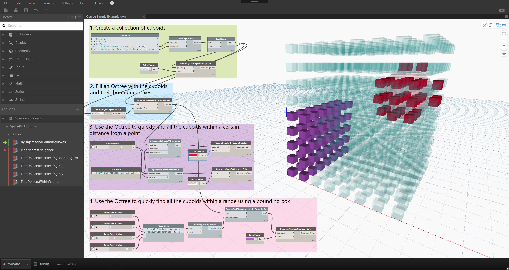

***This was an early 2019 demo of an approach to space partitioning in Dynamo.***

***The VASA package now offers much more sophisticated tools for spatial analysis:***
* VASA Intro video: https://www.youtube.com/watch?v=wE4gk0FYWDw
* Through the Interface blog posts on VASA: https://www.keanw.com/vasa/

---

# Dynamo Space Partitioning

A Dynamo package for common spatial search and intersection tests on large amounts of objects using tree data structures. The implementations here are currently naive and unoptimized, but they should still be considerably faster than brute force strategies.

### Currently supported:

* K-D trees indexed by points
   * 2D and 3D versions
   * Radius queries (Sphere intersection)
   * Nearest neighbor search
   * Implemented with [Supercluster.KDTree](https://github.com/MathFerret1013/Supercluster.KDTree)
* Octrees indexed by bounding box
   * 3D only
   * Hit tests (Point intersection)
   * Range queries (Bounding box intersection)
   * Radius queries (Sphere intersection)
   * Dynamo-specific implementation

### Future possibilities:

* K-D trees
   * Arbitrary dimensions
* Octrees
   * Ray intersection
   * Nearest neighbor search
   * Visibility tests (Frustum intersection)
* Quadtrees (2D Octree)
* Tuning of tree parameters for advanced users
* Fancier implementations (skip octrees, etc.)
* Memory optimizations

## In Use
*Examples/Octree Simple Example.dyn*

